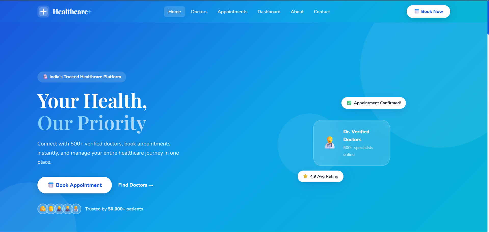
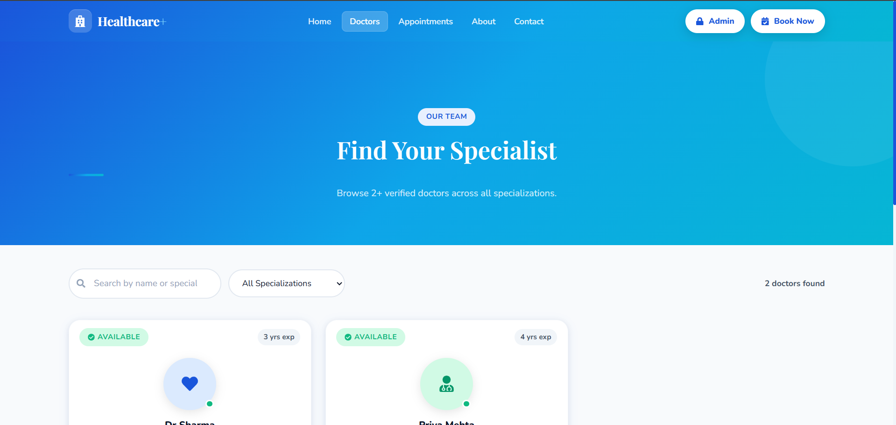
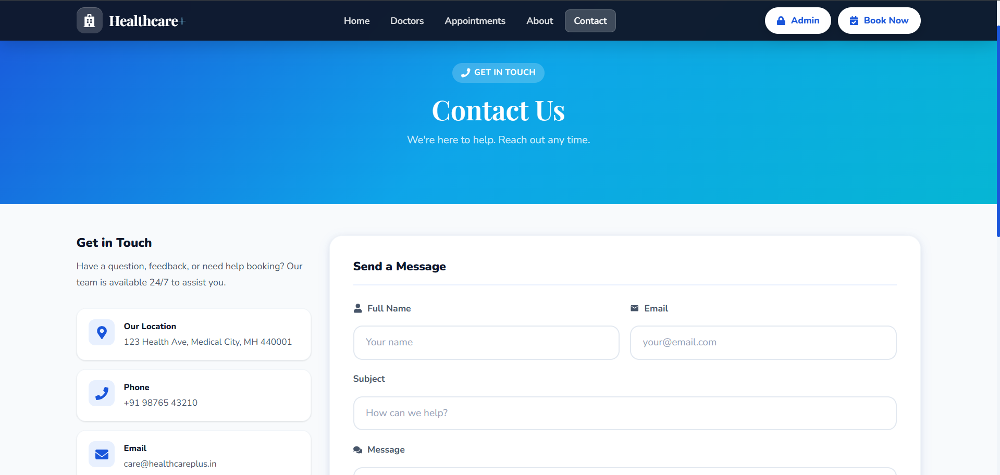
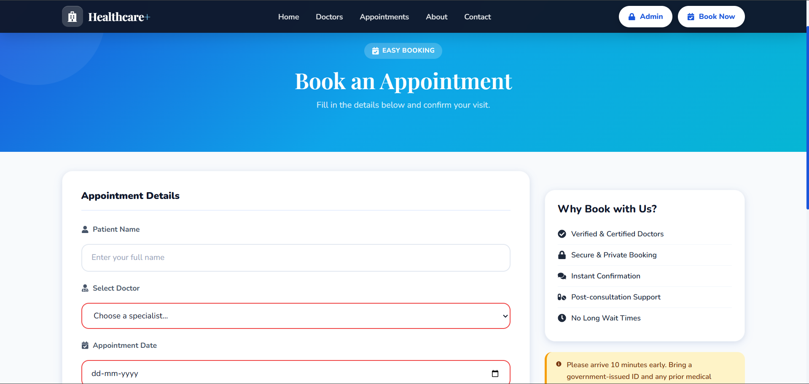
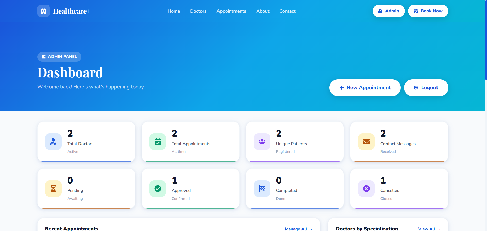
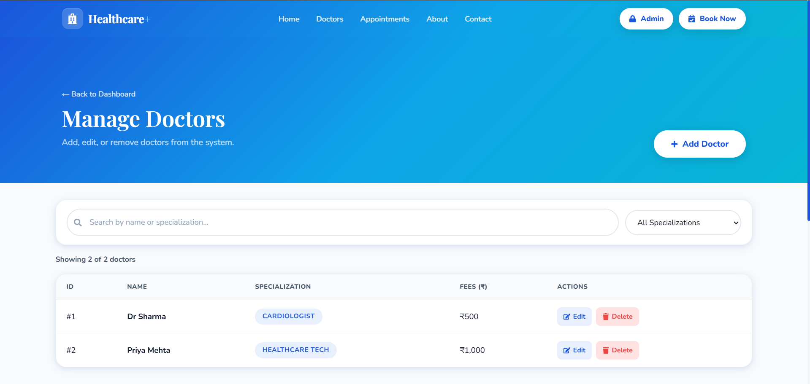
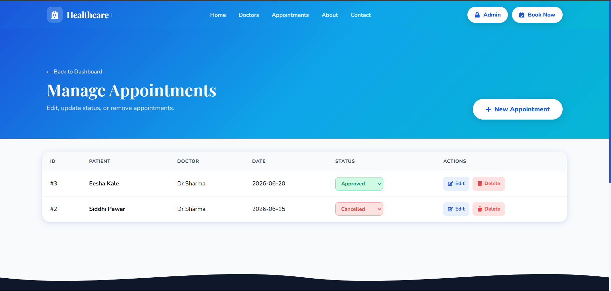

# Healthcare Management System

A full-stack Healthcare Management System built using **Spring Boot, React, and MySQL**. The application enables patients to browse doctors, book appointments, and contact healthcare support, while providing administrators with a dedicated dashboard to manage doctors, appointments, and inquiries efficiently.

---

## Features

### Patient Module

* View all available doctors
* Search doctors by specialization
* View detailed doctor profiles
* Book appointments online
* View appointment information
* Contact healthcare support
* Responsive and user-friendly interface

### Admin Module

* Secure Admin Login
* Dashboard Analytics
* Doctor Management

  * Add Doctor
  * Edit Doctor
  * Delete Doctor
* Appointment Management

  * View Appointments
  * Edit Appointments
  * Delete Appointments
  * Update Appointment Status
* Contact Message Management

  * View Messages
  * Delete Messages
* Logout Functionality

### Appointment Status Tracking

Appointments can be managed through the following statuses:

* PENDING
* CONFIRMED
* CANCELLED

---

## Technology Stack

### Frontend

* React
* Vite
* React Router DOM
* Axios
* CSS3

### Backend

* Spring Boot
* Spring Web
* JDBC Template
* Maven

### Database

* MySQL

### Version Control

* Git
* GitHub

---

## Project Structure

```text
healthcare-management-system
│
├── healthcare-ui/                 # React Frontend
│   ├── public/
│   ├── src/
│   └── package.json
│
├── src/main/java/com/siddhi/healthcare/
│   ├── controller/
│   ├── model/
│   ├── repository/
│   ├── service/
│   └── HealthcareApplication.java
│
├── src/main/resources/
│   └── application.properties
│
├── sql/
│   └── migration_add_appointment_status.sql
│
└── pom.xml
```

---

## Screenshots

### Home Page



### Doctors Page



### Contact Page



### Appointment Booking



### Contact Page


### Admin Dashboard



### Manage Doctors



### Manage Appointments



---

## Database Tables

### Doctor

| Field          | Type    |
| -------------- | ------- |
| id             | INT     |
| name           | VARCHAR |
| specialization | VARCHAR |
| experience     | INT     |
| fees           | DECIMAL |

### Appointment

| Field            | Type    |
| ---------------- | ------- |
| id               | INT     |
| patient_name     | VARCHAR |
| doctor_id        | INT     |
| appointment_date | DATE    |
| status           | VARCHAR |

### Contact Message

| Field   | Type    |
| ------- | ------- |
| id      | INT     |
| name    | VARCHAR |
| email   | VARCHAR |
| subject | VARCHAR |
| message | TEXT    |

---

## Installation

### Clone Repository

```bash
git clone https://github.com/siddhipawar424/healthcare-management-system.git
cd healthcare-management-system
```

### Backend Setup

Configure database credentials in:

```properties
src/main/resources/application.properties
```

Run backend:

```bash
mvn spring-boot:run
```

Backend URL:

```text
http://localhost:8080
```

### Frontend Setup

Navigate to frontend:

```bash
cd healthcare-ui
```

Install dependencies:

```bash
npm install
```

Run application:

```bash
npm run dev
```

Frontend URL:

```text
http://localhost:5173
```

---

## REST API Endpoints

### Doctors

```http
GET    /api/doctors
POST   /api/doctors
PUT    /api/doctors/{id}
DELETE /api/doctors/{id}
```

### Appointments

```http
GET    /api/appointments
POST   /api/appointments
PUT    /api/appointments/{id}
DELETE /api/appointments/{id}
PATCH  /api/appointments/{id}/status
```

### Contact Messages

```http
GET    /api/contact
POST   /api/contact
DELETE /api/contact/{id}
```

---

## Key Learning Outcomes

Through this project, I gained practical experience in:

* Full-Stack Application Development
* Building REST APIs using Spring Boot
* MySQL Database Design and CRUD Operations
* React Component-Based Architecture
* API Integration using Axios
* State Management with React Hooks
* Admin Dashboard Development
* Route Protection and Authentication Concepts
* Git and GitHub Version Control

---

## Future Enhancements

* JWT Authentication
* Role-Based Access Control (RBAC)
* Email Notifications
* Doctor Availability Scheduling
* Patient Portal
* Medical Records Module
* Online Payments
* Cloud Deployment

---

## Author

### Siddhi Pawar

GitHub: https://github.com/siddhipawar424
